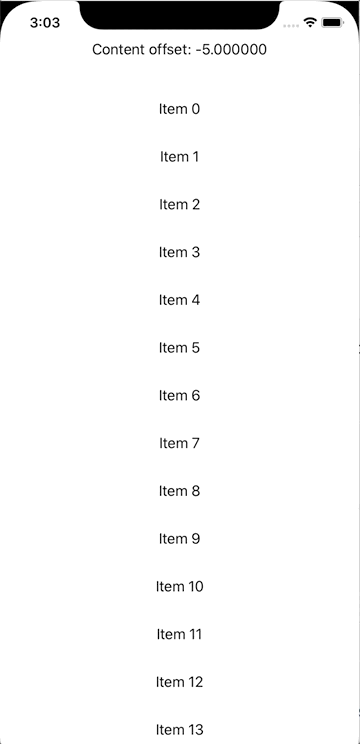

# TrackableScrollView
A customizable ScrollView that supports to get the content offset.



## Usage
```swift
TrackableScrollView(contentOffset: $contentOffSet) {
                ForEach(0..<100) { index in
                    Text("Item \(index)")
                    .padding()
                }
            }
